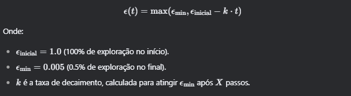

# Melhorando o Desempenho de Algoritmos TD com variantes do ε

---

### **Introdução**

Aprendizagem por Reforço (RL) é uma área fascinante da inteligência artificial, onde agentes aprendem a tomar decisões sequenciais em ambientes dinâmicos. Dois dos algoritmos mais clássicos são o **Q-Learning** e o **SARSA**, ambos baseados em **Diferença Temporal (TD)**. Um dos desafios desses algoritmos é equilibrar **exploração** (explore - tentar novas ações) e **exploitação** (exploit - usar o conhecimento atual) A estratégia **epsilon-greedy** é amplamente utilizada para esse fim.

 Neste artigo estaremos buscando responder as seguintes perguntas:

- É possível melhorar o desempenho dos algoritmos TD ao usar epsilon decrescente?
- E com epsilon que varia de forma adaptativa conforme o desempenho?

Exploraremos duas abordagens:

1. **Epsilon Decrescente**: Reduzir o valor de epsilon ao longo do tempo, de forma linear ou exponencial.
2. **Epsilon Adaptativo**: Ajustar epsilon com base no desempenho recente do agente.

Vamos discutir as modificações propostas, os experimentos realizados e analisar os resultados em diferentes ambientes, como **FrozenLake**, **CliffWalking** e **Taxi**.

---

### **1. O Papel do Epsilon na Aprendizagem por Reforço**

Antes de mergulharmos nas modificações, é importante entender o papel do **epsilon** na estratégia **epsilon-greedy**. O epsilon controla a probabilidade de o agente escolher uma ação aleatória (exploração) em vez de seguir a política atual (exploitação). Um valor alto de epsilon (próximo de 1) significa mais exploração, enquanto um valor baixo (próximo de 0) significa mais exploitação.

O problema é que, em muitos casos, um valor fixo de epsilon pode não ser ideal. Por exemplo:

- **Epsilon alto por muito tempo**: O agente pode continuar explorando demais, mesmo após aprender uma boa política.
- **Epsilon baixo desde o início**: O agente pode ficar preso em uma política subótima, sem explorar o suficiente.

Por isso, propomos estratégias de **decaimento do epsilon** e **epsilon adaptativo** para melhorar o desempenho dos algoritmos.

---

### **2. Estratégias de Decaimento do Epsilon**

Exploramos duas formas de decaimento do epsilon:

### **2.1 Decaimento Linear**

Nesta abordagem, o epsilon decai linearmente ao longo do tempo, de acordo com a fórmula:



### **2.2 Decaimento Exponencial**

Aqui, o epsilon decai exponencialmente:


### **2.3 Parametrização Simples**

Para simplificar, definimos:

- **X**: Número de passos até atingir ϵmin.
- **Y**: Proporção do tempo total de treinamento para decaimento (por exemplo, 25% do tempo total).

### **2.4. Epsilon Adaptativo**

Além do decaimento fixo, propomos uma abordagem adaptativa, onde o epsilon é ajustado com base no desempenho recente do agente. A ideia é:

- **Se o desempenho melhorar ou se manter**: Reduzir epsilon (menos exploração).
- **Se o desempenho piorar**: Aumentar epsilon (mais exploração).

A fórmula adaptativa pode ser definida como:


### **2.5. Trechos de Código**

Aqui estão as funções principal do epsilon nos experimentos:

**Epsilon Linear e Exponencial**

```python
def epsilon_decay_2(decay_type='none', initial_E=1.0, min_E=0.005, X=1000, Y=None, total_eps=None, episodes=8000, decay_rate=0.001):
    """
    Decaimento fixo do epsilon (linear ou exponencial), baseado em X passos ou Y proporção do tempo total.
    """
    # Calcula X a partir de Y, se fornecido
    if Y is not None:
        if total_eps is None:
            estimated_steps_per_episode = 500  # Estimativa do ambiente
            total_eps = episodes * estimated_steps_per_episode
        X = int(Y * total_eps)

    if X is None:
        raise ValueError("É necessário definir X ou Y para o decaimento.")

    if decay_type == 'none':
        def new_E(t):
            return initial_E
    elif decay_type == 'linear':
        k = (initial_E - min_E) / X
        def new_E(t):
            return max(min_E, initial_E - k * t)
    elif decay_type == 'exponential':
        decay_rate = math.log((initial_E - min_E) / (min_E - min_E + 1e-8)) / X  # Ajusta o decaimento
        def new_E(t):
            return min_E + (initial_E - min_E) * math.exp(-decay_rate * t)
    else:
        raise ValueError("Tipo de decaimento inválido. Escolha 'linear' ou 'exponential'.")

    return new_E
```

**Epsilon Adaptativo**

```python
def epsilon_decay(decay_type='none', initial_E=1.0, min_E=0.005,X=1000, Y=None, total_steps=1000,episodes=8000,decay_rate=0.001, threshold=.005,max_E=0.995,increase_rate=0.001, eps_limit_adaptive_to_consider=50):
    """
        decay_type (str): Tipo de decaimento ('linear' ou 'exponential', ou 'none').
        initial_E (float): Valor inicial de epsilon (epsilon máximo).
        min_E (float): Valor mínimo de epsilon.
        X (int): Número de passos para atingir o epsilon mínimo (opcional).
        Y (float): Percentual do tempo total de treinamento para decaimento (opcional).
        total_steps (int): Número total de passos de treinamento.
        decay_rate (float): Taxa de decaimento (apenas para decaimento exponencial).
        threshold (float): limite de mudança de recompensa para o Epsilon mudar
        recent_rewards (lista): lista com recompensas recentes
    """
...
    elif decay_type == 'adaptive':
        def new_E(E, recent_rewards):
          if len(recent_rewards) < 2:
            return E
          N = min(eps_limit_adaptive_to_consider, len(recent_rewards)//2)  # Número de episódios considerados
          recent_mean = np.mean(recent_rewards[-N:])
          if len(recent_rewards) >= 2*N: # atualizando se andou os episodios suficientes
            previous_mean = np.mean(recent_rewards[-2*N:-N])
          else:
            previous_mean = recent_mean  # Evita erro de variável não inicializada

          if recent_mean >= (previous_mean - threshold):  # Melhorou ou manteve
            E = max(E * decay_rate, min_E)
          elif E < max_E * 0.9:  # Desempenho piorou
              # aumento apenas se estiver significativamente abaixo do máximo
                E = min(E * increase_rate, max_E)
          return E
...
    return new_E
```

### **4. Experimentos e Análise de Dados**

Realizamos experimentos em três ambientes clássicos de RL: **FrozenLake**, **CliffWalking** e **Taxi**. Para cada ambiente, comparamos as estratégias de decaimento linear, exponencial e adaptativo, além de um baseline com épsilon fixo.

Para todos os experimentos onde não é citado diferenças nos parâmetros, esses foram os parâmetros utilizados para os treinamentos

| Parâmetros | Valor | descrição |
| --- | --- | --- |
| N_EPS_PER_REWARDS | 200 | episódios para média de recompensas |
| ENV_NAME | CliffWalking-v0 |  |
| r_max | 0 |  |
| EPISODES | 8_000 |  |
| LR | 0.2 |  |
| GAMMA | 0.95 |  |
| EPSILON_NORMAL | 0.1 |  |
| EPSILON_START | 1.0 |  |
| EPSILON_MIN | 0.005 |  |
| DECAY_LINEAR | 0.005 | taxa de decaimento linear para o epsilon |
| DECAY_EXP | 0.005 | taxa de decaimento exponencial para o epsilon |
| DECAY_ADAPTIVE | 0.005 | taxa de decaimento decremental para o epsilon |
| INCREASE_ADAPTIVE | 1.005 | taxa de aumento incremental para o epsilon |

### **4.1 CliffWalking**

### Experimento com Q-Learning

Ao rodar 500 episódios comparando o Q-Learning com epsilon fixo, com decaimento linear e exponencial. Os resultados ficaram mais próximos a medida que o Epsilon decaia para o mínimo mais rápido


Decaimento em 2000 episódios

Quanto maior o numero de episódios explorados (epsilon muito mais alto do que o epsilon fixo), ganha-se menos recompensa a curto prazo mas a convergência será feita quando atingir o episódio X com epsilon mínimo


Decaimento em 6000 episódios

Com a demora para o decaimento, fica visível a demora para o algoritmo demonstrar aptidão em receber melhores recompensas por conta da alta exploração o decaimento exponencial foi menos afetado


O decaimento adaptativo se mostrou o mais próximo a se aproximar do Q-Learning com epsilon fixo, ao mesmo tempo que apresenta menor oscilação, apesar de ter demorado mais para atingir a recompensa máxima.

### Experimento com SARSA


Com os mesmos parâmetros da função anterior (Q-learning), o decaimento linear no Sarsa encontrou um entrave onde a recompensa chegava a um limite que não ultrapassava. Ao diminuir o valor de X de 2000 para um valor menor próximo a 2000 (1000-1500) não surtiu considerável  diferença nos resultados. Utilizámos o valor 200 para o episódio limite de decaimento do X, e até mesmo no gráfico abaixo, foi possível observar como a alguma zona de oscilação para o linear que o fez ter dificuldade em atingir a mesma média de recompensas que o fixo e exponencial.


Pelo que vimos inicialmente, é possível convergir de forma que não prejudique o algoritmo para uma mesma faixa de recompensa máxima simplesmente passando um parâmetro X que define quando irá haver o limite de decaimento para atingir o Epsilon mínimo, até mesmo tempo como comparação um Q-Learning com Epsilon fixo de mesmo valor. Ademais, é possível verificar com base nas saídas do codigo que a média das recompensas após a convergência se tornou menos oscilatórias, podendo ser “melhor” pelo menos nesse sentido.

Também podemos ver que ao deixar os parâmetros fixos, e apenas alterar o X quanto mais tempo o epsilon permanecer alto menor seriam as recompensas e quanto menor seria maior as recompensas.

- **Resultados**: O decaimento adaptativo apresentou menos oscilações na recompensa média, enquanto o decaimento linear teve dificuldades em convergir.
- **Análise**: Em ambientes determinísticos como o CliffWalking, o decaimento adaptativo ajusta-se melhor ao desempenho do agente, evitando exploração excessiva.

### **4.2 FrozenLake**

No ambiente FrozenLake, ao executar o codigo com mesmo parametros anteriores porém com o X=2000 (epsilon decai para o epsilon mínimo nesse episódio), O decaimento linear se mostrou como o único a sair de 0 de recompensa.


Baseado nesse resultado, onde apenas trouxemos os parâmetros de um ambiente para outro sem alterações, o Q-Learning com decaimento linear se mostrou ter melhor desempenho tendo como métrica atingir melhores médias de recompensa.

Posteriormente fizemos ajustes, não na função de decaimento linear, mas nos epsilon mínimo () que foi de 0.005 para 0.2 e  máximo de 0.995 para 0.8, adaptando para o novo ambiente.


Se observamos até o episódio 1000, vimos que o decaimento linear conseguiu melhores recompensas nesse espaço de tempo do que o fixo e exponencial, devido

Abaixo, repete-se 100 vezes um experimento com os mesmos parâmetros do gráfico acima para fins de teste (NX está em 2000, que é 1/4 de todos os episodios): ao rodar esse algoritmo 100 vezes para o epsilon fixo, com decaimento linear e com decaimento exponencial temos o seguinte resultado:


Ao rodar 100 vezes o SARSA no FrozenLake (com os mesmos parametros do Experimento com o Q-Learning acima) tivemos resposta semelhante abaixo

Todos esses experimentos definiam X (quando o Epsilon vai decair) como 2000.


- **Resultados**: O decaimento linear mostrou-se eficaz nos primeiros episódios, mas o decaimento exponencial convergiu mais rapidamente para a recompensa máxima.
- **Análise**: O ambiente estocástico do FrozenLake beneficia-se de uma redução mais rápida do epsilon, permitindo que o agente explore menos e explore mais cedo.

### **4.3 Taxi**

Agora rodando apenas 1 vez o SARSA com exatamente os mesmos parametros de novo mas no ambiente Taxi (convergiram para recompensas idênticas novamente no episodio X):


Agora para visualizar o desempenho com parâmetros otimizados ao invés de com testes manuais como fizemos ao longo dos experimentos, realizamos o treinamento de parâmetros rodando 20 tentativas para linear e para exponencial vezes para o SARSA no ambiente Taxi-v3. Após isso vamos comparar as recompensas médias ao rodarmos 100 vezes para os paramêtros anteriores e com os otimizados, que inclusive alterará muita coisa impactante como o Y e taxas de decaimento

Aqui o X foi fixado em 2000, agora com o parametro Y, o episodio de decaimento dependerá completamente dele.

```python
episodios_de_busca = 8000
episodes = 8_000
lr = 0.2
gamma = 0.95
initial_E = 1.0
min_E = 0.2
n_eps_per_rewards = 200
max_E = 0.8
# params moveis#####
decay_linear = 0.0005
decay_exponential = 0.001
        
def train_sarsa_decay_2_linear(ambient, trial: optuna.Trial):
    try:
        # Configurações e chamada para run_sarsa_decay_2
        clear_output()
        X = 2000 
        Y = trial.suggest_float('Y', 0.0001,1)
        decay_rate = trial.suggest_float('decay_rate', decay_linear*.001,decay_linear*100, log=True)
        decay_type = 'linear'

        env = gym.make(ambient)
        returns, _,_,_ = run_sarsa_decay_2(env, episodes,mode=1, lr=lr, gamma=gamma, initial_E=initial_E,
                                       min_E=min_E, X=X, Y=Y,decay_rate=decay_rate, decay_type = decay_type,max_E=max_E)
        if isinstance(returns, list) and len(returns) > 0:
            return np.mean(returns)
        else:
            return 0.0 
    except Exception as e:
        print(f"Erro no trial: {e}")
        return 0.0  # Retorna um valor padrão em caso de erro  
...
```


Aqui foi usado os mesmos paramêtros usados nas outras funções mas agora o SARSA rodou 20vezes no ambiente Taxi para o epsilon fixo, com decaimento linear e exponencial.


Aqui foi usado os hiperparametros para o linear e para o exponencial (apenas mudou as taxas de decaimento), rodou 20 vezes para cada algoritmo, uma pequena mudança percentual, diferentemente de quanto mudamos o X como vimos anteriormente.


- **Resultados**: O decaimento exponencial superou as outras estratégias, atingindo a recompensa máxima mais rapidamente.
- **Análise**: O ambiente complexo do Taxi beneficia-se de uma redução gradual do epsilon, permitindo que o agente explore o suficiente antes de explorar.

Os experimentos mostram que:

- **Epsilon Decrescente**: Tanto o decaimento linear quanto o exponencial melhoram o desempenho em comparação com epsilon fixo, mas o decaimento exponencial tende a ser mais eficaz em ambientes estocásticos.
- **Epsilon Adaptativo**: A abordagem adaptativa é particularmente útil em ambientes onde o desempenho do agente pode variar significativamente, permitindo ajustes dinâmicos no equilíbrio entre exploração e explotação.

Neste artigo, exploramos como estratégias de decaimento do epsilon e epsilon adaptativo podem melhorar o desempenho de algoritmos TD, como Q-Learning e SARSA. Os resultados mostram que:

- **Decaimento Exponencial** é geralmente mais eficaz em ambientes estocásticos.
- **Epsilon Adaptativo** é ideal para ambientes onde o desempenho do agente varia ao longo do tempo.

Como trabalhos futuros, sugerimos explorar outras estratégias de decaimento e aplicar essas técnicas em ambientes mais complexos, como jogos ou robótica.

# lembrar de colocar as referências