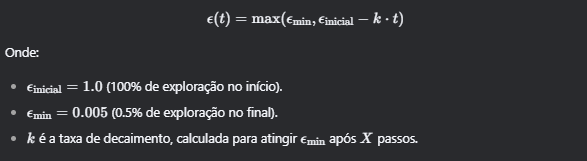
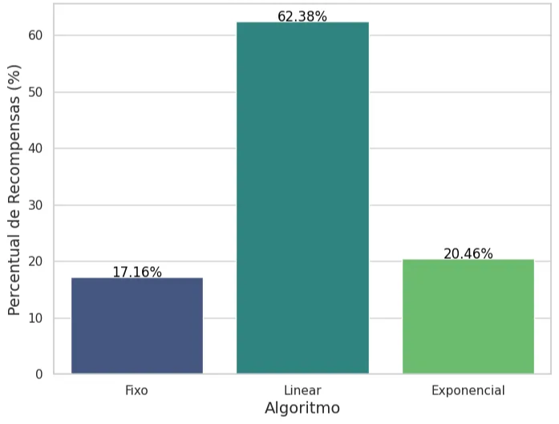

# Melhorando o Desempenho de Algoritmos TD com variantes do ε

---

<a target="_blank" alt="Open In Colab" href="https://colab.research.google.com/drive/1E3tU9lVkJwSkWxa0RHoidjQs4AHoJRRM?usp=sharing"></a>

Vídeo

[](https://www.youtube.com/watch?v=rmEmAiH0nOQ)

### **Introdução**

Aprendizagem por Reforço (RL) é uma área fascinante da inteligência artificial, onde agentes aprendem a tomar decisões sequenciais em ambientes dinâmicos. Dois dos algoritmos mais clássicos são o **Q-Learning** e o **SARSA**, ambos baseados em **Diferença Temporal (TD)**. Um dos desafios desses algoritmos é equilibrar **exploração** (explore - tentar novas ações) e **exploitação** (exploit - usar o conhecimento atual) A estratégia **epsilon-greedy** é amplamente utilizada para esse fim.

Neste artigo estaremos buscando responder as seguintes perguntas:

- É possível melhorar o desempenho dos algoritmos TD ao usar epsilon decrescente?
- E com epsilon que varia de forma adaptativa conforme o desempenho?

Exploraremos duas abordagens:

1. **Epsilon Decrescente**: Reduzir o valor de epsilon ao longo do tempo, de forma linear ou exponencial.
2. **Epsilon Adaptativo**: Ajustar epsilon com base no desempenho recente do agente.

Vamos discutir as modificações propostas, os experimentos realizados e analisar os resultados em diferentes ambientes, como **FrozenLake**, **CliffWalking** e **Taxi**.

---

### **1. O Papel do Epsilon na Aprendizagem por Reforço**

Antes de mergulharmos nas modificações, é importante entender o papel do **epsilon** na estratégia **epsilon-greedy**. O epsilon controla a probabilidade de o agente escolher uma ação aleatória (exploração) em vez de seguir a política atual (exploitação). Um valor alto de epsilon (próximo de 1) significa mais exploração, enquanto um valor baixo (próximo de 0) significa mais exploitação.

O problema é que, em muitos casos, um valor fixo de epsilon pode não ser ideal. Por exemplo:

- **Epsilon alto por muito tempo**: O agente pode continuar explorando demais, mesmo após aprender uma boa política.
- **Epsilon baixo desde o início**: O agente pode ficar preso em uma política subótima, sem explorar o suficiente.

Por isso, propomos estratégias de **decaimento do epsilon** e **epsilon adaptativo** para melhorar o desempenho dos algoritmos.

---

### **2. Estratégias de Decaimento do Epsilon**

Exploramos duas formas de decaimento do epsilon:

### **2.1 Decaimento Linear**

Nesta abordagem, o epsilon decai linearmente ao longo do tempo, de acordo com a fórmula:



### **2.2 Decaimento Exponencial**

Aqui, o epsilon decai exponencialmente:


### **2.3 Parametrização Simples**

Para simplificar, definimos:

- **X**: Número de passos até atingir ϵmin.
- **Y**: Proporção do tempo total de treinamento para decaimento (por exemplo, 25% do tempo total).

### **2.4. Epsilon Adaptativo**

Além do decaimento fixo, propomos uma abordagem adaptativa, onde o epsilon é ajustado com base no desempenho recente do agente. A ideia é:

- **Se o desempenho melhorar ou se manter**: Reduzir epsilon (menos exploração).
- **Se o desempenho piorar**: Aumentar epsilon (mais exploração).

A fórmula adaptativa pode ser definida como:


### **2.5. Trechos de Código**

Aqui estão as funções principal do epsilon nos experimentos:

**Epsilon Linear e Exponencial**

```python
def epsilon_decay_2(decay_type='none', initial_E=1.0, min_E=0.005, X=1000, Y=None, total_eps=None, episodes=8000, decay_rate=0.001):
    """
    Decaimento fixo do epsilon (linear ou exponencial), baseado em X passos ou Y proporção do tempo total.
    """
    # Calcula X a partir de Y, se fornecido
    if Y is not None:
        if total_eps is None:
            estimated_steps_per_episode = 500  # Estimativa do ambiente
            total_eps = episodes * estimated_steps_per_episode
        X = int(Y * total_eps)

    if X is None:
        raise ValueError("É necessário definir X ou Y para o decaimento.")

    if decay_type == 'none':
        def new_E(t):
            return initial_E
    elif decay_type == 'linear':
        k = (initial_E - min_E) / X
        def new_E(t):
            return max(min_E, initial_E - k * t)
    elif decay_type == 'exponential':
        decay_rate = math.log((initial_E - min_E) / (min_E - min_E + 1e-8)) / X  # Ajusta o decaimento
        def new_E(t):
            return min_E + (initial_E - min_E) * math.exp(-decay_rate * t)
    else:
        raise ValueError("Tipo de decaimento inválido. Escolha 'linear' ou 'exponential'.")

    return new_E
```

**Epsilon Adaptativo**

```python
def epsilon_decay(decay_type='none', initial_E=1.0, min_E=0.005,X=1000, Y=None, total_steps=1000,episodes=8000,decay_rate=0.001, threshold=.005,max_E=0.995,increase_rate=0.001, eps_limit_adaptive_to_consider=50):
    """
        decay_type (str): Tipo de decaimento ('linear' ou 'exponential', ou 'none').
        initial_E (float): Valor inicial de epsilon (epsilon máximo).
        min_E (float): Valor mínimo de epsilon.
        X (int): Número de passos para atingir o epsilon mínimo (opcional).
        Y (float): Percentual do tempo total de treinamento para decaimento (opcional).
        total_steps (int): Número total de passos de treinamento.
        decay_rate (float): Taxa de decaimento (apenas para decaimento exponencial).
        threshold (float): limite de mudança de recompensa para o Epsilon mudar
        recent_rewards (lista): lista com recompensas recentes
    """
...
    elif decay_type == 'adaptive':
        def new_E(E, recent_rewards):
          if len(recent_rewards) < 2:
            return E
          N = min(eps_limit_adaptive_to_consider, len(recent_rewards)//2)  # Número de episódios considerados
          recent_mean = np.mean(recent_rewards[-N:])
          if len(recent_rewards) >= 2*N: # atualizando se andou os episodios suficientes
            previous_mean = np.mean(recent_rewards[-2*N:-N])
          else:
            previous_mean = recent_mean  # Evita erro de variável não inicializada

          if recent_mean >= (previous_mean - threshold):  # Melhorou ou manteve
            E = max(E * decay_rate, min_E)
          elif E < max_E * 0.9:  # Desempenho piorou
              # aumento apenas se estiver significativamente abaixo do máximo
                E = min(E * increase_rate, max_E)
          return E
...
    return new_E
```

### **3. Experimentos e Análise de Dados**

Realizamos experimentos em três ambientes clássicos de Reinforcement Learning (RL): **FrozenLake**, **CliffWalking** e **Taxi** - os algoritmos TD sendo \*\*\*\*Q-Learning o off-policy e o SARSA o on-policy. Para cada ambiente, comparamos estratégias de decaimento de epsilon (ε) — linear, exponencial e adaptativo — além de um baseline com epsilon fixo. Abaixo estão os parâmetros utilizados nos experimentos, exceto quando mencionadas diferenças específicas.

### **Parâmetros Utilizados**

| Parâmetro         | Valor           | Descrição                                                     |
| ----------------- | --------------- | ------------------------------------------------------------- |
| N_EPS_PER_REWARDS | 200             | Número de episódios para calcular a média de recompensas      |
| ENV_NAME          | CliffWalking-v0 | Nome do ambiente                                              |
| r_max             | 0               | Recompensa máxima (em alguns ambientes não vai ser utilizado) |
| EPISODES          | 8,000           | Número total de episódios de treinamento                      |
| LR                | 0.2             | Taxa de aprendizado (Learning Rate)                           |
| GAMMA             | 0.95            | Fator de desconto (Discount Factor)                           |
| EPSILON_NORMAL    | 0.1             | Valor de epsilon fixo                                         |
| EPSILON_START     | 1.0             | Valor inicial de epsilon                                      |
| EPSILON_MIN       | 0.005           | Valor mínimo de epsilon                                       |
| DECAY_LINEAR      | 0.005           | Taxa de decaimento linear para epsilon                        |
| DECAY_EXP         | 0.005           | Taxa de decaimento exponencial para epsilon                   |
| DECAY_ADAPTIVE    | 0.005           | Taxa de decaimento adaptativo para epsilon                    |
| INCREASE_ADAPTIVE | 1.005           | Taxa de aumento incremental para epsilon                      |

---

### **3.1 CliffWalking**

### **Experimento com Q-Learning**

Ao executar 500 episódios comparando Q-Learning com epsilon fixo, decaimento linear e exponencial, observamos que os resultados se aproximaram à medida que o epsilon decaiu para o valor mínimo mais rapidamente.


- **Decaimento em 2000 episódios**: Com mais episódios explorados (epsilon alto), há menor recompensa a curto prazo, mas a convergência ocorre quando o epsilon atinge o valor mínimo no episódio X.


- **Decaimento em 6000 episódios**: Com um decaimento mais lento, o algoritmo demora a demonstrar aptidão para receber melhores recompensas devido à alta exploração. O decaimento exponencial foi menos afetado.


- **Decaimento Adaptativo**: Esta estratégia se aproximou do Q-Learning com epsilon fixo, apresentando menor oscilação, e foi o que teve desempenho mais arecido com o fixo.

### **Experimento com SARSA**

Repetindo exatamente os mesmos parâmetros de antes, sem qualquer ajuste


- **Decaimento Linear**: Encontrou um limite onde a recompensa não ultrapassava um certo valor. Ajustes no valor de X (episódio de decaimento) não trouxeram diferenças significativas.
- **Decaimento Exponencial**: Apresentou desempenho semelhante ao epsilon fixo, com menor oscilação nas recompensas médias após a convergência.
- Aqui o parâmetro X foi setado para 200, para avaliar o resultado em uma convergência mais forçada as recompensas médias para o epsilon fixo


- **Resultados**: Pelo que vimos inicialmente, é possível convergir de forma que não prejudique o algoritmo para uma mesma faixa de recompensa máxima simplesmente passando um parâmetro X que define quando irá haver o limite de decaimento para atingir o Epsilon mínimo, até mesmo tempo como comparação um Q-Learning com Epsilon fixo de mesmo valor.
- **Análise**: Ademais, é possível verificar com base nas saídas do codigo que a média das recompensas após a convergência se tornou menos oscilatórias, podendo ser “melhor” pelo menos nesse sentido.. Ao deixar os parâmetros fixos, e apenas alterar o X quanto mais tempo o epsilon permanecer alto menor seriam as recompensas e quanto menor seria maior as recompensas.

---

### **3.2 FrozenLake**

No ambiente FrozenLake, utilizamos os mesmos parâmetros do CliffWalking, com X = 2000 (epsilon decai para o mínimo no episódio 2000).

- **Q-Learning com Decaimento Linear**: Foi o único a sair de 0 de recompensa, mostrando melhor desempenho inicial.


- **Ajustes nos Valores de Epsilon**: Ao ajustar o epsilon mínimo para 0.2 e o máximo para 0.8, o decaimento linear obteve melhores recompensas nos primeiros 1000 episódios em comparação com o epsilon fixo e exponencial.


- **Testes Repetidos**: Ao repetir o experimento 100 vezes, o decaimento linear manteve sua eficácia inicial, enquanto o decaimento exponencial convergiu mais rapidamente para a recompensa máxima.


- Ao rodar o mesmo experimentos de execução 100 vezes para usando SARSA ao invés de Q-learning


- **Resultados**: O decaimento linear foi eficaz nos primeiros episódios, mas o decaimento exponencial convergiu mais rapidamente para a recompensa máxima.
- **Análise**: Em ambientes estocásticos como o FrozenLake, uma redução mais rápida (exponencial no caso) do epsilon beneficia o agente, permitindo que ele explore menos e explore mais cedo.

---

### **3.3 Taxi**

### **Experimento com SARSA**

- **Parâmetros Padrão**: Com os mesmos parâmetros dos experimentos anteriores, o SARSA no ambiente Taxi convergiu para recompensas idênticas no episódio X.


- **Otimização de Parâmetros**: Realizamos 20 tentativas para ajustar os parâmetros de decaimento linear e exponencial. Após a otimização, rodamos o algoritmo 100 vezes para comparar as recompensas médias.

  ```python
  episodios_de_busca = 8000
  episodes = 8_000
  lr = 0.2
  gamma = 0.95
  initial_E = 1.0
  min_E = 0.2
  n_eps_per_rewards = 200
  max_E = 0.8
  # params moveis#####
  decay_linear = 0.0005
  decay_exponential = 0.001

  def train_sarsa_decay_2_linear(ambient, trial: optuna.Trial):
      try:
          # Configurações e chamada para run_sarsa_decay_2
          clear_output()
          X = 2000
          Y = trial.suggest_float('Y', 0.0001,1)
          decay_rate = trial.suggest_float('decay_rate', decay_linear*.001,decay_linear*100, log=True)
          decay_type = 'linear'

          env = gym.make(ambient)
          returns, _,_,_ = run_sarsa_decay_2(env, episodes,mode=1, lr=lr, gamma=gamma, initial_E=initial_E,
                                       min_E=min_E, X=X, Y=Y,decay_rate=decay_rate, decay_type = decay_type,max_E=max_E)
          if isinstance(returns, list) and len(returns) > 0:
              return np.mean(returns)
          else:
              return 0.0
      except Exception as e:
          print(f"Erro no trial: {e}")
          return 0.0  # Retorna um valor padrão em caso de erro
  ...

  ```

- SEM hiperparâmetros



- COM hiperparâmetros


---

**Conclusão Geral**

- **Epsilon Variante**: Tanto o decaimento linear quanto o exponencial melhoram o desempenho em comparação com epsilon fixo, especialmente em ambientes estocásticos, onde a exploração é mais benéfica.
- Baseado nos poucos experimentos envolvendo o epsilon adaptativo, vimos que é uma abordagem que se adapta fácilmente ao ambiente podendo fácilmente atingir resultados próximos ao epsilon fixo em situações onde o linear e exponencial tem menor desempenho.

Os experimentos demonstraram que a escolha da estratégia de decaimento de epsilon deve considerar as características do ambiente e os objetivos de curto e longo prazo do agente.

### **4. Referências**

[1] **Rl_facil**. Pablo Azevedo Sampaio. [https://github.com/pablo-sampaio/rl_facil](https://github.com/pablo-sampaio/rl_facil)
